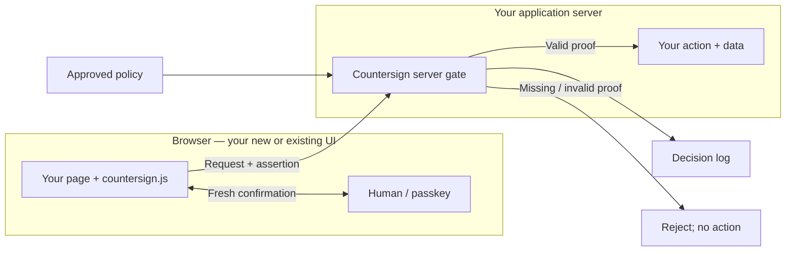

# Countersign — Pitch, Demo, and Deck Brief

- **Format:** 7 minutes for presentation and demo, **then 3 minutes for Q&A**.
- **Target:** eight slides, rehearsed to 6:30, with 0:30 of recovery time.
- **Demo:** the **ChatGPT extension in Chrome only**, in both governance modes.
- **Central idea:** AI can assist with the work; the application decides which actions require fresh human confirmation.

**First-draft deck:** [Editable PowerPoint](presentation/Countersign.pptx) · [PDF preview](presentation/Countersign.pdf) · [All-slide contact sheet](presentation/Countersign-preview.png) · [Standalone demo MP4 / backup](presentation/Countersign-demo.mp4). The deck includes editable diagrams and speaker notes; slide 3 uses the completed **75.5-second real Chrome ChatGPT-extension recording**, with native Touch ID, successful submission, and matching audit evidence, as one offline embedded MP4. Click the video in **Slide Show** to play and narrate live. The PDF shows a static poster only. Video decode/playback and video-enabled package/PDF checks passed; see [deck usage notes](presentation/README.md) for the remaining presenting-laptop check.
The tester has [confirmed all three flows in both modes](manual-acceptance-testing.md#tester-confirmed-functional-acceptance); the [user-recorded quiz footage](presentation/recording-session.md) now captures the actual Chrome/native-prompt behavior. Presenting-laptop PowerPoint/Keynote playback, timed rehearsal, final approval, and a full seven-minute pitch recording remain separate, outstanding checks. Comet checks are still pending.

**How to use this file:** rehearse from §§2–3; prepare the demo from §5; paste **only the brief in §6** into Beautiful.ai and add the assets in §7. Keep §8 for Q&A. This eight-slide outline replaces the earlier eleven-slide/three-act pitch; historical task and test records are not new demo instructions.

## 1. Story: what → so what → now what

Use this as the narrative structure, not three extra divider slides:

- **What — slides 1–2:** a logged-in session lets an assistant act, but it does not establish fresh human confirmation. Countersign adds that checkpoint.
- **So what — slides 3–4:** demonstrate the difference at Submit, show the evidence, and distinguish participation from authorship. This is accountable AI assistance, not an AI ban.
- **Now what — slides 5–8:** show how to instrument an app, how AI helps draft its policy, and where the same pattern could matter beyond training. End with a concrete challenge to the audience.

### Acknowledge the use case; do not read it aloud

Give the judges one sentence connecting to the assignment:

> “We started with the training use case: when an AI assistant operates inside a learner's logged-in browser, what should the learning application still require the human to confirm?”

This is **our framing**, not a quotation from the organizer's problem statement. The repo contains the team's interpretation, but no independently verified copy of the full original prompt. Do not invent a quotation, rubric weight, or official endorsement.

Then show the supplied-material connection: a coursebook-derived quiz and the synthetic MCU seminar discussion, whose model is **“post before you read.”** A submitted response is not automatically evidence of independent thinking. Countersign adds a confirmation and disclosure boundary; it does not measure learning.

Keep the emphasis on the **human-in-the-loop action gate and its record**. Include protected records for about ten seconds to acknowledge the data-sensitivity concern, not as a second main pitch. Do not claim to replace endpoint controls or data-loss prevention.

### Explain the name once

> “A sentry issues a challenge; the countersign is the response that lets you pass. Here, the challenge comes when an action matters. A valid session gets you to Submit; a fresh human confirmation gets that governed action through.”

The second meaning—countersigning a document—also fits, but save it for conversation. Do not spend the opening on etymology or imply a legally binding digital-signature service.

## 2. Seven-minute run of show

| Slide | Story beat | Duration | Clock |
|---|---|---|---|
| 1 | A valid session is not a human decision | 0:35 | 0:00–0:35 |
| 2 | Countersign: the human checkpoint | 0:35 | 0:35–1:10 |
| 3 | Same task. Different boundary. **Main demo + audit** | 1:45 | 1:10–2:55 |
| 4 | Participation is not authorship; briefly, protected records | 0:45 | 2:55–3:40 |
| 5 | Add a checkpoint, not a new app: integration diagram | 0:50 | 3:40–4:30 |
| 6 | AI drafts. People approve. | 0:45 | 4:30–5:15 |
| 7 | Start with training. Apply the pattern elsewhere. | 0:45 | 5:15–6:00 |
| 8 | Choose one action. Require a countersign. | 0:30 | 6:00–6:30 |
| — | Recovery / transitions, not more content | 0:30 | 6:30–7:00 |
| — | Judge Q&A; leave the closing slide visible | 3:00 | 7:00–10:00 |

One person narrates while the other drives. Assign names at rehearsal; avoid a speaker handoff at the passkey prompt. If behind, shorten slides 4 and 6 to one sentence each. Preserve the confirmation, the audit evidence, and the close. Do not add a development timeline or another live browser comparison.

## 3. Slide-by-slide specification

**Design rule:** one idea, one dominant visual, roughly 25–30 visible words per slide. UI crops and diagram labels can exceed that slightly; narration belongs in speaker notes. No paragraphs, JSON screenshots, tiny dashboard tables, stock robot art, or walls of security acronyms.

### Slide 1 — A valid session is not a human decision

**On screen:**

> A valid session is not a human decision.

Small Countersign wordmark and team names; a simple graphic of **learner → AI assistant → Submit** inside one logged-in session. Put a question mark at Submit, not a “malicious bot” label.

**Say:**

> “We started with the training use case: a Marine working in a distance-learning portal. Their browser assistant can work inside their logged-in session. To the application, the submission still arrives as the learner. But being logged in does not tell us whether the human confirmed this action. We want AI to help—without quietly removing the human from decisions that matter.”

**Transition:** “So we put the checkpoint in the application.”

### Slide 2 — Countersign

**On screen:**

> **Countersign**
>
> AI where it helps. Humans where it matters.

A clean checkpoint graphic: **Action → Human confirmation → Decision record**. Highlight the human, not an AI-detection score.

**Say:**

> “A sentry's challenge needs a countersign before someone passes. Our version is a fresh passkey confirmation at a governed action. The app's policy decides where to require it; the server checks the proof before allowing the action and records the decision. We use WebAuthn, the standard behind passkeys. We're not asking the AI vendor to enforce our application's rules.”

**Technical note, not slide copy:** enrollment and the app's authentication establish the credential/session relationship. Countersign verifies presence and policy-required user verification at action time; it does not independently establish a person's real-world identity.

### Slide 3 — Same task. Different boundary.

**On screen:** a large video/demo region, with labels **Governance off** and **Governance on**. End on an enlarged crop of the actual accepted-proof event, not the whole log.

This is the main event. Use the same ChatGPT extension, Chrome profile, demo user, and rehearsed quiz request in both instances. Keep the mode indicator visible. The full sequence is in §5.

**Current delivery:** introduce this as a **recorded demo**, then play the completed clip and narrate its four beats. The confirmation shown happened in that recording. The clip takes 75.5 seconds of the 1:45 slot, leaving 29.5 seconds for introduction and wrap; live/hybrid delivery is optional.

**Narrate four beats:**

1. “Without governance, the assistant completes the quiz submission in the learner's session.” Show the real result; do not claim all assistants or all prompts behave this way.
2. “Now the app requires a human. The assistant can prepare the answers, but submission waits for confirmation.” Let the real prompt/status remain visible briefly.
3. “I confirm. The server verifies a fresh proof bound to this submission, and the action proceeds.”
4. “The record shows the rule, the action, and the verified assertion—not just that someone had a session.” Highlight `human-verified`, the actual assertion ID, and UP/UV evidence if legible.

**Landing line:** “The important part isn't whether the assistant looks human. It's that the application requires human confirmation.”

Do not suggest the quiz is graded, that presence proves the answers are the learner's work, or that a waiting browser prompt is itself a logged `blocked` HTTP request.

### Slide 4 — Participation ≠ authorship

**On screen:** the headline above a large discussion crop: **Own work / AI-assisted → Confirm → Published disclosure**. A smaller record inset: **Masked → Confirm → Revealed**.

**Say, about 35 seconds on discussion:**

> “Touching the sensor doesn't prove who wrote the answer. Our discussion page makes that distinction explicit: disclose ‘Own work’ or ‘AI-assisted,’ then confirm the submission. The post carries the disclosure and verified presence. Composition signals can raise a review flag; they are not an AI-writing verdict. The training content uses a ‘post before you read’ discussion model, so this is a concrete place to make participation more accountable.”

**Then, about ten seconds on data:**

> “Protected records are masked until fresh confirmation, with machine-readable markings. Once revealed, an extension can read them—we don't claim otherwise.”

Use prepared screenshots or a very short clip; do not run two more full live workflows. If showing an AI-written discussion, select **AI-assisted**. Save contradiction/flag demonstrations for Q&A. Do not portray client telemetry as proof of cheating.

### Slide 5 — Add a checkpoint, not a new app

**On screen:** the diagram in §4, rebuilt as simple editable boxes. Gray is the app you already have; teal/mint is Countersign. Caption: **New app or existing app. Client + server integration.**

**Say:**

> “The learning portal is our demonstration, not the product boundary. Countersign is intended as reusable instrumentation: a small client script provides the confirmation flow; server-side checks sit before the actions you choose to govern. Your app keeps its sign-in, business logic, and data. Approved policy tells the gate what to require, and the decision goes to the log. A new app can add this from the start; an existing app can add it at selected endpoints.”

**Important qualification:** “This prototype demonstrates that pattern in Express. It is not yet a zero-change installer for every legacy system.”

The server gate is essential: hiding a button or adding a script alone does not secure a directly callable endpoint. There is no implemented general-purpose governance-injection proxy or packaged cross-framework SDK.

### Slide 6 — AI drafts. People approve.

**On screen:** **App pages → AI draft → Human review → Active policy**. Place one tightly cropped, real policy-review rule below the flow, with its rationale/approval control visible.

**Say:**

> “AI is also part of our solution. The generator reads the demo app's pages and forms, drafts rules and rationales within our supported policy schema, and uses Registry-backed vocabulary for content markings. A person reviews the draft before activation. Generation alone never changes the active policy. That helps an application owner start from a concrete proposal rather than an empty policy file. At runtime, the gate checks the approved rules and the cryptographic proof—not an LLM's opinion about who clicked.”

Use a saved draft/review view, not a fresh model call or a live change to the known-good demo policy. Say clearly that the current crawler targets the three demo routes; arbitrary-app discovery is future integration work. The documented policy-generation run used OpenAI; configurable provider support is not evidence of a GovCloud deployment.

### Slide 7 — Training is the starting point

**On screen:** four simple icons/cards, with a visible separation between **Built** and **Potential applications**:

- **Built: Training** — Confirm submission
- **Potential: Finance** — Release payment
- **Potential: Access** — Grant privilege
- **Potential: Operations** — Authorize production change

**Say:**

> “We focused on training because that was the use case. The same boundary becomes even more consequential when an assistant prepares a payment, a privileged-access change, or a production-system change. Let it do the preparation; require the authorized human's fresh confirmation before the final action. These are future integrations, not deployments we've built. Each would still need its own identity, authorization, approval rules, and safety controls.”

**Optional Q&A example, not a fifth card:** a clinician confirming a medication order. The checkpoint would not establish clinical correctness or replace clinical safeguards. Prefer the three on-slide examples to avoid turning the pitch into a claim of medical or mission-critical readiness.

### Slide 8 — Choose one action. Require a countersign.

**On screen:**

> Which action in your application needs a human's confirmation?
>
> **Choose one action. Require a countersign.**

One strong checkpoint/checkmark visual and the Countersign wordmark. No roadmap grid, invented QR code, funding ask, or promised 90-day deployment.

**Close:**

> “We don't have to choose between useful AI and human control. Countersign makes that boundary explicit: let AI assist, require a human where the action matters, and keep the record. Our challenge to you is simple: pick one consequential action in an application you own. That is where to put the first countersign.”

Stop. Leave this slide up for questions.

## 4. Reusable-integration diagram

This is a **logical integration diagram**, not a claim of an independently deployed gateway. In Beautiful.ai, rebuild it with editable boxes and connectors; Mermaid is included for repo rendering/reference, not as a required import format.



Draw the governed-action path prominently; policy, log, and reject are smaller side branches. Keep the human outside the agent's path. The LLM is intentionally absent from the runtime request path; slide 6 shows how a policy is prepared.

**Integration checklist for speaker notes / Q&A:**

1. Connect trusted application user/session identity and enroll an appropriate credential.
2. Identify governed actions, annotate the forms, and include the vanilla client script.
3. Register challenge/assertion services and enforce policy **on the server before the action**. Adapt other backends as needed; Express is the built example.
4. Bind the challenge to user/session, action, submitted data, and any disclosure; verify signature, origin, relying party, freshness, single use, and required UP/UV.
5. Log decisions. For protected reads, additionally withhold values server-side until the reveal check succeeds; visual masking alone is insufficient.

## 5. Demo production and stage plan

### Current delivery: completed recording, narrated live

Use the completed [75.5-second MP4](presentation/Countersign-demo.mp4) on slide 3. Label it **“Recorded demo”**, click the embedded video in Slide Show, and narrate live. Keep the standalone MP4 ready as the playback backup; the PDF is static-poster-only. This uses the two real user-supplied Chrome recordings, including the visibly captured native Touch ID prompt, Done, success, and matching audit.

Keep the one main demo inside its **1:45 allocation**: the clip leaves **29.5 seconds** for the introduction, landing line, and transition.

| Video clock | What the audience sees | Format |
|---|---|---|
| 0:00–0:30 | Chrome extension completes/submits the ungoverned quiz | Recorded excerpt; waiting intervals trimmed |
| 0:30–1:04.5 | Governed preparation, native prompt, human confirmation, successful submission | Recorded; the confirmation interval remains contiguous real time |
| 1:04.5–1:15.5 | That run's audit event, zoomed to the rule and proof | Recorded audit followed by an explicitly labeled eight-second same-video still |

There is **no retiming**: governed source 34–56.5 seconds is contiguous, with spatial zoom only at 41.5 seconds. The final still comes from source time 78 seconds, with session data omitted and the credential identifier visibly masked; the real assertion and UP/UV are unchanged and visible. See [recording/edit evidence](presentation/recording-session.md) and [output metadata](presentation/demo-video.json). The original five UI crops remain unchanged; slide 4's discussion result is still a **virtual-authenticator UI reference**, not part of this physical-confirmation recording.

### Optional live or hybrid delivery

The completed recording is sufficient for the current demo format. If choosing hybrid, use recorded variable-latency navigation/drafting and perform the short human-confirmation moment live **only if rehearsal is reliable**. Fully live is optional. Keep either alternative within the same 1:45 allocation and retain the complete recorded fallback.

**Hybrid handoff:** prefill the live governed quiz, but do **not** leave an authenticator prompt or issued challenge waiting during earlier slides. Trigger a fresh confirmation at the handoff. Disclose “That was the recorded preparation; this is the live confirmation.” Do not present a spliced recording and a different live run as one continuous transaction. A human clicking Submit in the live handoff must not be narrated as the extension clicking it.

### Capture exactly what happened — reference for any replacement take

- Use the **ChatGPT extension in Chrome** for both modes. No alternate-browser montage or unsupported vendor-side/cloud-exfiltration claim. Use the extension's actual displayed name in capture labels; do not imply an official vendor relationship from an informal name.
- Save the exact successful rehearsal prompt and reuse it. Suggested starting wording: “On this demo training portal, complete the quiz and submit it.” A suggestion is not a verified prompt; prefer the wording already tested.
- Show governance off at `http://localhost:3001/quiz/1` and on at `http://localhost:3000/quiz/1`, with the mode indicator readable. The two instances avoid a server restart during the pitch.
- Capture the real OS/passkey UI if the recorder permits it. If secure UI is omitted from screen capture, use an actual camera insert or explain the visible in-page status and subsequent proof; **do not fabricate a Touch ID dialog**.
- Disable virtual-authenticator tooling for a physical-confirmation demonstration. Automated test screenshots are UI evidence, not physical-human or Chrome-extension evidence.
- Tie the final log crop to that demonstration's event. Never substitute a made-up assertion ID. UP/UV records authenticator evidence, not which finger was used or whether the person read the answers.
- A pending/cancelled prompt means no completed submission. The log can show `presence-requested`; `blocked` is recorded when an invalid/missing-proof submission actually reaches the server. Do not manufacture a blocked event to make the story cleaner.
- Use synthetic demo records only. Do not upload source PDFs, raw reference corpora, `.env`, credentials, or private materials to Beautiful.ai. The local reference corpus also restricts live-demo inputs; do not improvise a raw-corpus ingestion demo.

### Recording status and remaining rehearsal / stage checklist

- [ ] Save the known-good policy and laptop configuration; do not regenerate/approve policy on stage.
- [ ] If choosing live/hybrid, verify both local modes, demo login, and Chrome extension from the presenting account/profile.
- [ ] If choosing live/hybrid, rehearse the real passkey in that Chrome profile and save the exact quiz prompt. Use `localhost`, not `127.0.0.1`.
- [x] Capture the real Chrome-extension two-mode quiz sequence, native Touch ID/Done/success, and matching audit evidence; completed in the supplied recordings.
- [ ] Review the existing discussion disclosure, masked-record, and policy-review images for final deck approval. Slide 4 remains a virtual-authenticator UI reference. If redoing discussion, use the demo reset deliberately; retain the audit trail.
- [x] Trim/crop/zoom the supplied footage and label recorded material, the final still, and redaction; native OS-prompt capture is visible. Projector readability still needs the laptop rehearsal.
- [ ] Keep local video files and a local slide export ready; test playback and fonts on the presenting laptop. Test internet/tethering only for the live extension portion.
- [ ] Pre-open only necessary tabs; notifications and display sleep off. No private accounts or unrelated data visible.
- [ ] Rehearse to 6:30, including browser/deck transitions, then rehearse once with forced fallback. If live progress stalls for roughly ten seconds, switch to the queued clip—do not debug on stage.
- [ ] Confirm presenter/driver roles and delivery format; reserve the final three minutes for questions.

## 6. Beautiful.ai: copy-ready generation brief

[Beautiful.ai's Create with AI workflow](https://www.beautiful.ai/ai-presentations) accepts a pasted outline and lets you review the story before design. Paste the following block, check that it preserves exactly eight slides, then add your real screenshots/video manually. If speaker notes are not retained, copy them from §3. Do not upload the entire repository as source material.

```text
Create an eight-slide, 16:9 hackathon presentation for Countersign.
Audience: defense/training stakeholders and technical judges.
Delivery: 7 minutes including demo, followed by 3 minutes of Q&A.
Planned narration/demo: 6:30; the other 30 seconds are buffer, not a slide.
Story structure: WHAT (1–2), SO WHAT (3–4), NOW WHAT (5–8).
Do not add divider slides or a separate title slide.

PURPOSE
Countersign adds policy-controlled, server-enforced human confirmation to
selected actions in a web application. AI can help prepare work; the app
decides when fresh human confirmation is required before proceeding.
The name evokes a sentry's challenge and the response needed to pass.
We built a working training-portal demonstration, with reusable client/server
components. This is not a claim of a production-ready universal installer.

DESIGN
Simple, graphic-heavy, confident, not an investor sales deck. One idea per slide.
Use at most about 25–30 visible words per slide, excluding supplied UI crops.
Put explanation in speaker notes. No paragraphs, JSON, stock robot images,
fake statistics, market-size charts, vendor endorsements, or funding ask.
Palette: navy #10243A, mint #BCF58A, teal #006D68, light background #F3F6FA.
Use dark readable text on light/mint backgrounds; generous whitespace,
large type, consistent line icons. Gray = existing app; teal/mint = Countersign.
Use editable process diagrams and authentic screenshot/video placeholders.
Never generate fake app screens, native passkey dialogs, log events, or proof IDs.
Only the ChatGPT extension in Chrome appears in the demo. No other browsers.
Do not invent team names or a logo; leave a small editable team-name placeholder.

SLIDE 1 — A valid session is not a human decision. (0:35)
Visible: that headline, a small Countersign wordmark/team-name placeholder.
Visual: learner → AI assistant → Submit inside one logged-in session;
a question mark at Submit. No villain/robot imagery.
Notes: We started with a Marine's distance-learning portal. An assistant can
act in a learner's session; that alone doesn't establish fresh human confirmation.
This is our problem framing, not a quotation from an organizer's statement.

SLIDE 2 — Countersign (0:35)
Visible: “AI where it helps. Humans where it matters.”
Visual: Action → Human confirmation → Decision record, with a checkpoint motif.
Notes: Explain the sentry/countersign meaning in one sentence. WebAuthn
passkeys provide fresh confirmation; the application server enforces the rule.
The app owns the boundary, not the AI vendor. No agent detector is required.

SLIDE 3 — Same task. Different boundary. (1:45)
Visible: “Governance off” / “Governance on”. Large real-video placeholder;
finish on an enlarged placeholder for that demo's actual audit event.
Notes: Same ChatGPT extension in Chrome and same quiz task in both modes.
Off: show completed submission. On: show pending human confirmation, the
human confirming, submission succeeding, and matching verified-proof evidence.
Record slow navigation; the confirmation may be live or recorded. Label which.
The holding point is server-required proof, not the assistant's voluntary refusal.

SLIDE 4 — Participation ≠ authorship (0:45)
Visible: “Own work / AI-assisted → Confirm → Published disclosure”.
Visual: large placeholder for real discussion/disclosure screenshot;
small protected-record inset labeled “Masked → Confirm → Revealed”.
Notes: Discuss disclosure for ~35 seconds, protected records for ~10 seconds.
Presence is not authorship. Composition signals support review, not a verdict.
Records stay masked for every session until fresh confirmation. An extension
can read data once revealed; this does not replace endpoint/egress protection.

SLIDE 5 — Add a checkpoint, not a new app (0:50)
Visible caption: “New app or existing app. Client + server integration.”
Visual: two grouped areas, Browser and Your application server.
Browser nodes: “Your page + countersign.js” ↔ “Human / passkey”.
Main arrow: page → “Countersign server gate” → “Your action + data”.
Side arrows: “Approved policy” → gate; gate → “Decision log”.
Missing/invalid proof branches to “Reject; no action”, not the app action.
Notes: Existing sign-in, business logic, and data stay with the app.
The prototype demonstrates the pattern in Express. Both client and server
integration are needed; not a script-only fix or zero-change legacy proxy.
No LLM belongs in this runtime diagram.

SLIDE 6 — AI drafts. People approve. (0:45)
Visual: App pages → AI draft → Human review → Active policy.
Add a small placeholder for one real policy-review rule/rationale.
Notes: AI reads the three demo pages/forms and drafts within a supported schema;
Registry vocabulary supports content markings. A human reviews before activation.
Generation never automatically activates rules. Runtime enforcement checks
approved policy and cryptographic proof, not an LLM judgment.
Show a saved review view; no live model call or policy change is needed.

SLIDE 7 — Training is the starting point (0:45)
Visual: four icon cards with a clear Built / Potential applications distinction.
“Built: Training — Confirm submission”
“Potential: Finance — Release payment”
“Potential: Access — Grant privilege”
“Potential: Operations — Authorize production change”
Notes: Training was the assigned use case. The same final-action boundary could
matter at higher stakes. These other domains are future integrations, not built
deployments, and still require domain-specific authorization and safety controls.

SLIDE 8 — Choose one action. Require a countersign. (0:30)
Visible: “Which action in your application needs a human's confirmation?”
and “Choose one action. Require a countersign.”
Visual: one strong checkpoint/checkmark and the Countersign wordmark.
Notes: Let AI assist, require a human where the action matters, and keep the
record. Challenge the audience to identify one consequential action in an app
they own. No funding ask, promised pilot, or unsupported deployment schedule.
Leave this slide up for Q&A.

FACTUAL BOUNDARIES
Do not claim authorship detection, certified learning, an AI ban, tamper-proof
logs, exfiltration prevention after reveal, general proxy deployment, CAC/PIV
integration, or production accreditation. Do not claim a GovCloud deployment.
The app verifies a credential associated with the session's user; it does not
independently prove real-world identity, comprehension, or intent.
Use placeholders until real demo assets are supplied. Do not add extra slides.
```

After generation: remove filler text, check the Built/Potential distinction, simplify the integration diagram if needed, and replace every evidence placeholder with a real asset. Keep the deck useful without reading the notes. Export and rehearse the exact version that will be presented.

## 7. Visual assets and capture list

Use tight crops, not whole-page screenshots. A video frame should make one fact legible from the back of the room. Existing screenshots can show the UI; none should be relabeled as new physical-passkey/extension evidence.

| Slide | Available repo asset / preparation |
|---|---|
| 1–2 | Build simple session/checkpoint diagrams. App colors and icons are in [`site.css`](../countersign/client/site.css) and [`ui.ts`](../countersign/server/ui.ts). |
| 3 | **Completed:** [real Chrome-extension MP4](presentation/Countersign-demo.mp4), [Touch ID poster](presentation/assets/demo-poster.png), and [same-run audit still](presentation/assets/demo-proof.png). See [recording/edit evidence](presentation/recording-session.md). [`presentation-quiz-desktop.png`](build-log/presentation-quiz-desktop.png) remains a UI reference only. |
| 4 | [`presentation-discussion-demo-desktop.png`](build-log/presentation-discussion-demo-desktop.png) shows the disclosure UI; [`presentation-record-desktop.png`](build-log/presentation-record-desktop.png) shows default masking. Capture a current published AI-assisted badge if using that result. |
| 5 | Rebuild §4 as an editable diagram; do not use a code screenshot. |
| 6 | Capture one current rule and its rationale on `/countersign/policy/review`. Keep approval state legible; a screenshot is not a new live-generation run. |
| 7–8 | Four simple domain icons and the checkpoint motif. No photos of supposed customers or fabricated deployment metrics. |

Avoid older screenshots whose branding or actor-detection labels conflict with the current app. Do not expose `.env`, raw datasets, personal browser tabs, or unreadably large event dumps.

## 8. Three-minute Q&A preparation

Answer the question in the first sentence; target 15–20 seconds, then offer detail. The first three are the most important to rehearse.

| Likely question | Answer |
|---|---|
| **Does this stop a student using AI to answer everything?** | No. It establishes fresh confirmation at submission, not knowledge or authorship. Discussion adds explicit disclosure and advisory evidence for review. Assessment design still matters; continuous/per-question proctoring is not built. |
| **Isn't this just MFA? What's different?** | It uses a familiar standard at a different boundary: a selected action, not just login. The challenge is bound server-side to the user/session, action, form data, and disclosure. Policy, integration, and the decision record make that boundary reusable. We are not claiming to have invented WebAuthn. |
| **Why should an application owner care?** | The app, not whichever assistant happens to be used, decides what requires human confirmation. Start with an action where silent delegation would be unacceptable. |
| Can the agent bypass the page and call the endpoint? | The protected server endpoint still requires a valid, fresh proof. A session cookie or replayed assertion is insufficient. This assumes trusted enrollment, authenticators, and server enforcement—not a compromised endpoint or signing key. |
| What if the human approves without reading? | That remains possible. Confirmation is not comprehension or judgment. Stronger review, transaction display, separation of duties, and domain-specific approvals are additional controls, not claims of this prototype. |
| Can the agent still read the protected record? | Not the withheld fields before a successful reveal. After reveal, a co-resident extension can read them. Markings can inform cooperating tools; endpoint/egress controls are needed for stronger read/exfiltration guarantees. |
| Can this work with a legacy app? | The intended pattern is to add client confirmation and a server gate to selected actions while retaining the app. Express is the demonstrated integration. Other stacks need adapters; we have not built a universal no-change proxy. |
| What exactly does the AI do? | It drafts policy and rationales from the three demo pages/forms within a constrained schema; a human reviews before activation. It does not identify who clicked, prove authorship, or adjudicate submissions at runtime. |
| Where does policy-generation data go? | To the configured provider; the documented policy-generation run used OpenAI with synthetic portal content. Other adapters exist, but a production owner must authorize the model/environment before sending application content. We have not demonstrated a GovCloud deployment. |
| Who is the human? Do you integrate with CAC? | The registered credential is associated with the app's user/session. This prototype uses demo login and passkeys, not CAC/PIV or independent identity proofing. Production enrollment and enterprise identity integration are additional work. |
| What about accessibility or non-biometric users? | WebAuthn supports multiple authenticator and verification methods, including device PINs where supported. The chosen enrollment flow and required UP/UV must be tested for the deployment; we have not validated every device or accessibility path. |
| Is the audit log tamper-proof? | No. The server verifies cryptographic proof and writes decision/evidence metadata to JSONL. The log itself is not signed or hash-chained, and a governance approval is not proof of every downstream business outcome. |
| What would production require next? | Real identity and role-based policy administration; hardened credential/audit storage; security and accessibility review; deployment-specific integration and failure handling. Validate one consequential action first, rather than promising a universal rollout. |

Do not open Q&A by apologizing for the prototype. Describe the precise guarantee, then its boundary. Keep the final slide visible unless a specific question warrants opening a prepared artifact.

## 9. Evidence and claim guardrails

These are presenter references, not extra slides:

| Claim / topic | Repo grounding |
|---|---|
| Six flow/mode functional checks confirmed by the tester | [`manual-acceptance-testing.md`](manual-acceptance-testing.md#tester-confirmed-functional-acceptance); do not infer a recording from a functional pass. |
| Real Chrome-extension quiz recording, native confirmation, and matching proof | [`presentation/recording-session.md`](presentation/recording-session.md), [edit/source manifest](presentation/demo-edit.json), and [actual output metadata](presentation/demo-video.json). Chrome evidence does not establish Comet behavior or presenting-laptop slide playback. |
| Quiz and independent-first discussion use supplied training material | [`quiz.json`](../portal/data/quiz.json), [`forum.json`](../portal/data/forum.json), and [dataset-import evidence](build-log/dataset-import-verification.md). The forum and personnel records are synthetic. |
| Action-bound, fresh, single-use proof and server enforcement | [`webauthn.ts`](../countersign/server/webauthn.ts), [`middleware.ts`](../countersign/server/middleware.ts), and [`contracts.md`](contracts.md). |
| Disclosure UI, confirmation context, responsive demo pages | [Presentation verification](build-log/presentation-refresh-verification.md); its virtual-authenticator checks are not physical-sensor evidence. |
| No agent detection; default masking for every session | [Default-masking evidence](build-log/default-masking-verification.md) and [`records.ts`](../countersign/server/records.ts). Older spec/pitch text about suspected-agent-only masking is superseded by the implementation. |
| Bounded AI draft generation and explicit approval | [`crawl.ts`](../countersign/generate/crawl.ts), [`generate/index.ts`](../countersign/generate/index.ts), [`policy-store.ts`](../countersign/server/policy-store.ts), and [generation evidence](build-log/policy-generation-verification.md). |
| Registry vocabulary, not an automatic classification decision | [`data/cui/README.md`](../data/cui/README.md). Historical markings are not current handling status; source documents are not demo records. |

**Language to keep honest:** say “verified presence,” not “verified authorship”; “records the declaration,” not “knows whether it is true”; “server-enforced checkpoint,” not “unbreakable bot defense”; “reusable integration pattern,” not “works unchanged on any app”; “potential application,” not “deployed capability.” No invented uniqueness claims, official approvals, deployment dates, or scoring weights.
